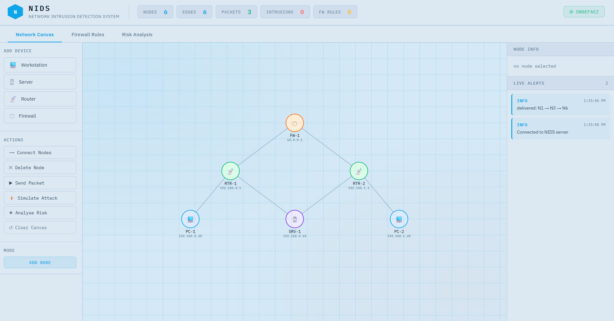
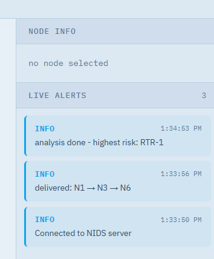

# Network Intrusion Detection System (NIDS)

A browser-based tool to simulate network behavior and detect suspicious activity in real time. This project visualizes a network as an interactive graph and applies graph algorithms to analyze traffic patterns and identify anomalies.

---

## Overview

This project allows users to build and analyze a custom network topology directly in the browser. It integrates real-time communication, graph-based algorithms, and backend processing to simulate packet flow and detect abnormal behavior.

---

## Live Demo

🔗 https://nids-demo.onrender.com

> Note: The server may take a few seconds to start if hosted on a free tier.

---

## Screenshots





---

## Features

* Interactive canvas to create and modify network topology
* Packet simulation using shortest-path routing
* Real-time anomaly detection for suspicious traffic
* Firewall rule system based on IP/port filtering
* Live updates using WebSockets
* Risk analysis of nodes using graph algorithms
* Persistent storage using a relational database

---

## Tech Stack

* **Frontend:** HTML, CSS, JavaScript (D3.js)
* **Backend:** Node.js, Express
* **Real-time:** Socket.io
* **Database:** MySQL with Prisma ORM

---

## Core Concepts Used

### Breadth First Search (BFS)

Used to compute shortest paths in the network graph.

* Time Complexity: O(V + E)
* Application: Packet routing and anomaly detection

---

### Betweenness Centrality

Used to identify critical nodes in the network.

* Time Complexity: O(V × (V + E))
* Application: Risk analysis

---

## Project Structure

```
server/
├── index.js
├── app.js
├── style.css
├── NetworkCanvas.html
├── prisma/
│   ├── schema.prisma
│   └── migrations/
├── package.json
└── .env
```

---

## Future Improvements

* Advanced anomaly detection techniques
* Improved UI/UX for better visualization
* Deployment optimization and scalability
* Additional analytics for network monitoring

---

## Author

Ayush Ghosh
NIT Hamirpur — Electronics and Communication Engineering

